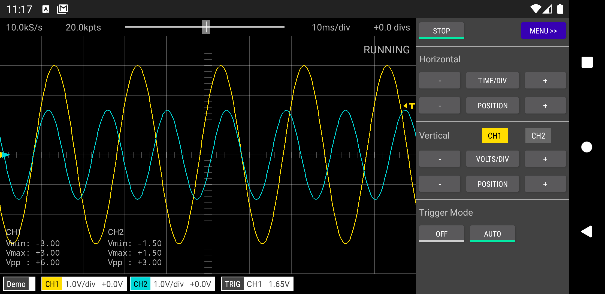
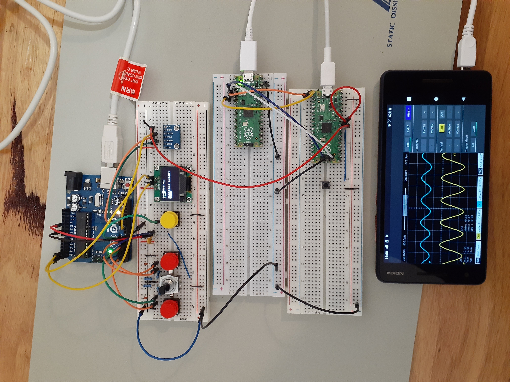

# Scoppy
Scoppy is a simple oscilloscope that consists of an Android App for your phone/tablet and firmware for your Raspberry Pi Pico. No programming is required.

Signals are measured by the Pico and the waveform is displayed on the Android device.

## What you'll need
* An Android device that's running Android version 23 (Marshmallow) or higher. The device must also support USB OTG (On-The-Go) - most modern phones/tablets do
* A USB OTG adapter/cable compatible with your phone/tablet.
* A Rasperry Pi Pico board

## Quick Start
### 1. Install the Scoppy Android App
Install the [Scoppy Android app](https://play.google.com/store/apps/details?id=xyz.fhdm.scoppy) from the Play Store.

### 2. Install the firmware onto your Pico
Copy the [pico-scoppy-v1.uf2](https://scoppy.fhdm.xyz/downloads/scoppy-pico-v1.uf2) file onto your Pico. The onboard LED should start blinking.

### 3. Connect the Pico to your Phone/Tablet
Attach the OTG adapter/cable to the USB input of the Android device. The other end attaches to the USB cable you have connected to your Pico.

### 4. Start Scoppying!
Attach one probe (wire) to GPIO26 of the Pico and the other to ground. This will allow you to measure signals between 0V and 3.3V. Of course the signal voltage should be within the allowed range of the ADC pins of the RP2040. See section 5.2.3 of the RP2040 Datasheet for more information. For Channel 2, attach a probe to GPIO27.

## Detailed installation instructions
See [here](Install.md) for more detailed installation instructions.

## Measuring different voltage ranges
See [here](Install.md).

## Tips
* If the traces or grid lines look too narrow then you can change the width in Settings (tap Menu to see the Settings option)
* Long-pressing most of the control buttons will set the corresponding setting to a default value eg. long-pressing the horizontal position button will reset the horizontal position back to zero
* Long-pressing any of the +/- buttons will continuously change the corresponding value. The longer you press it the faster the value will change.
* Tapping/dragging anything on the grid won't work! That functionality is yet to be implemented. For now you need to use the control buttons.
* To change the trigger level or channel tap the TRIG badge at the bottom of the screen

## Quirks
* If the screen turns off or the app is no longer in the foreground the run mode will change to STOPPED (to prevent draining the battery). You will need to tap RUN to restart the scope.
* The OFF trigger mode prevents all triggering and Scoppy will set the horizonal position so that it is displaying the most recent samples (it normally tries to find a trigger point near the centre of the sample record). This may or may not be useful for viewing very slowly changing signals.
* The sampling rate changes automatically as you change TIME/DIV so if you zoom in or out of a signal you might find the trace changing from under you. To prevent this tap STOP before changing the TIME/DIV setting.

## Troubleshooting
* If the Pico doesn't seem to be connecting try the following:
    * tap STOP and then RUN
    * OR
    * unplug the USB cable and plug it back in
* If it's still not working then it's possible that your phone/tablet doesn't support USB OTG. You can test this by attaching a USB thumb drive to the OTG cable/adapter. You should be able to browse the files on the drive.

## Missing Functionality
I'll look at adding the following if there is enough interest in the app:

* Single shot capture
* Normal mode triggering
* More measurements eg. Frequency
* Better touch interface eg. dragging the trigger indicator to change trigger level and swiping to change horizontal position.
* More trigger settings eg. falling edge
* Cursors

## Specifications
* Max. Sampling Rate: 500kS/s (shared between channels)
* Time/Div: 5us - 20secs
* Memory depth depends on sampling rate. It ranges between 2kpts (shared between channels) to 20kpts.
* Frame rate: 5fps

## Gallery

The Scoppy app in Demo mode

Scoppy under development. From left to right: Arduino Uno, AD9833 waveform generator and associated paraphenalia, Pico acting as debugger, Pico running an early version of the scoppy-pico firmware, Nokia 2.1

