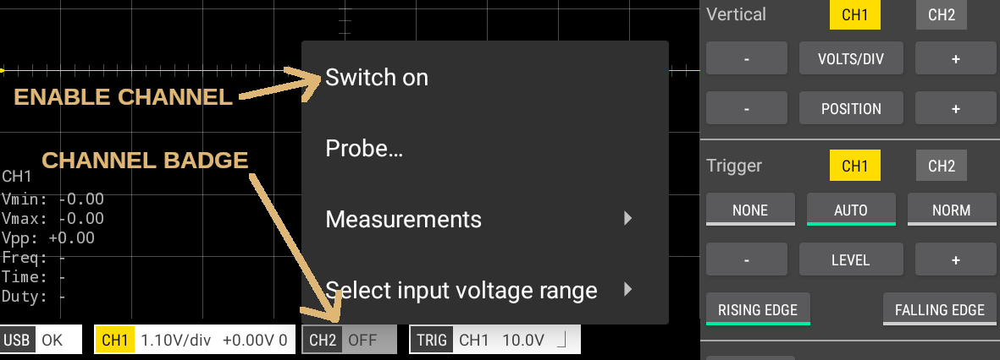
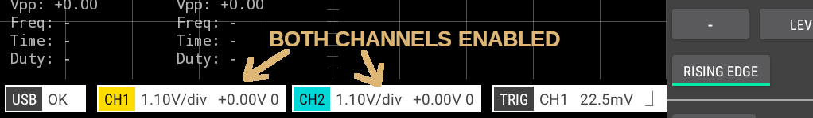

## Enabling/Disabling Channels

Channels can be enabled/disabled (switched on or off) by tapping the channel badge and selecting the appropriate option from the popup menu. Alternatively, tapping and holding the channel badge will toggle its enabled state.

 

> TIP. Tapping and holding the channel badge will switch the channel on or off.

 

## Probe attenuation

The probe attenuation value can also be configured. Tap the channel badge and select _Settings_ and then _Probe_ from the menu.

## Measurements > On-screen

Select this from the popup menu to configure the on-screen measurements

> TIP. Tapping the the on-screen measurements will display configuration screen for the measurements.

## Measurements > Snapshot

Select this from the popup menu to view the snapshot measurements

> TIP. Long pressing the the on-screen measurements will display the snapshot measurements.

 

