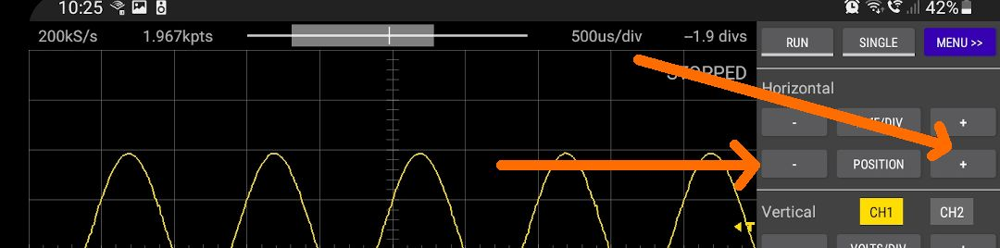
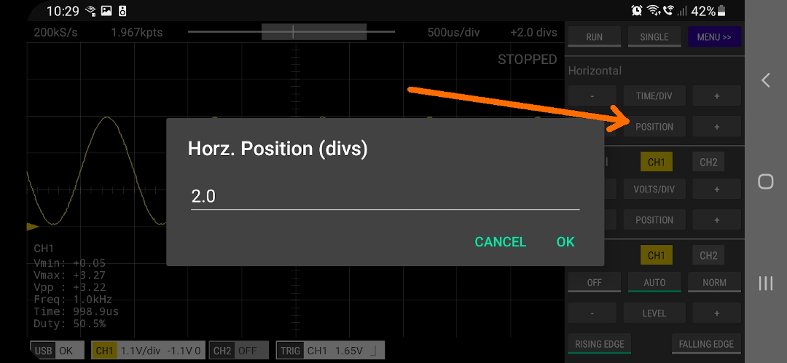

There are a number ways that the horizontal position can be adjusted.

 

### 1. Touch Gestures

Swipe to the left or right.

 

### 2. POSITION + and - Buttons

Single tap these buttons or tap-and-hold.

 

### 3. Single Tap the POSITION Button

This allows you to enter an exact value.

 

### 4. Tap and Hold the POSITION Button

This will set the POSITION to its default value (0 divs).

 
[App Help](.)     
[All Documentation](../TOC)         
[Scoppy on GitHub](https://github.com/fhdm-dev/scoppy)
