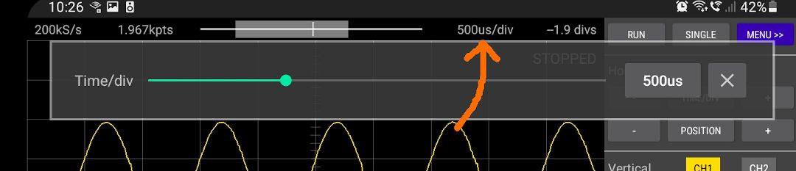
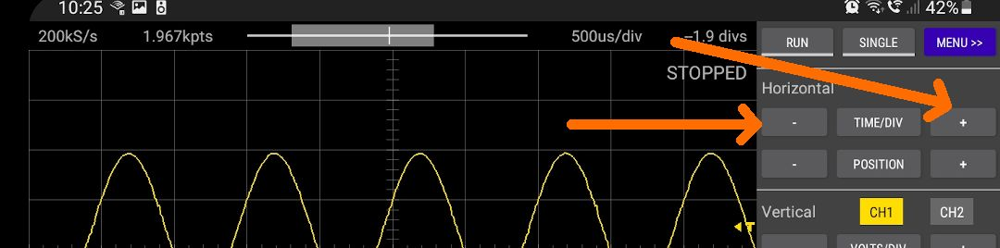
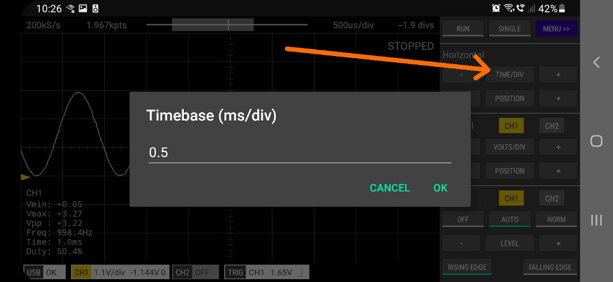

There are a number ways that the horizontal scale (Time/div) can be adjusted.

### 1. Slider
Tap the Time/div value that is displayed at the top of the screen. The Time/div setting can be adjusted by moving the slider. This is a good method
for finding the signal if the frequency is not known or for coarse adjustment of the setting. When looking for a signal of unknown frequency, move the
slider fairly slowly so that Scoppy can update the sampling rate as the timebase changes.

> TIP: When looking for a signal of unknown frequency, start at the shortest timebase setting (ie. start from the left) to reduce the chance of seeing
aliased versions of the signal.

 

### 2. Touch Gestures

Pinch and zoom on the screen horizontally.

 

### 3. TIME/DIV + and - Buttons

Single tap these buttons or tap-and-hold.

 

### 4. Single Tap the TIME/DIV Button

This allows you to enter an exact value.

 

### 5. Tap and Hold the TIME/DIV Button

This will set the TIME/DIV to its default value (10ms/div).

 
#### See Also

