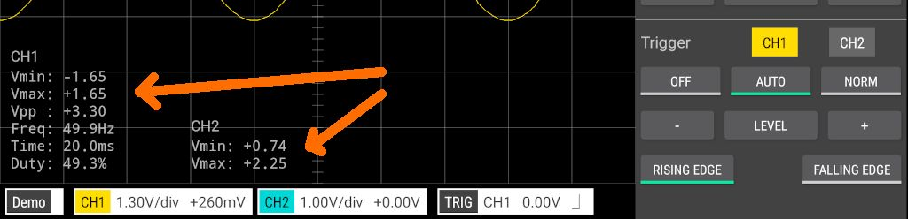
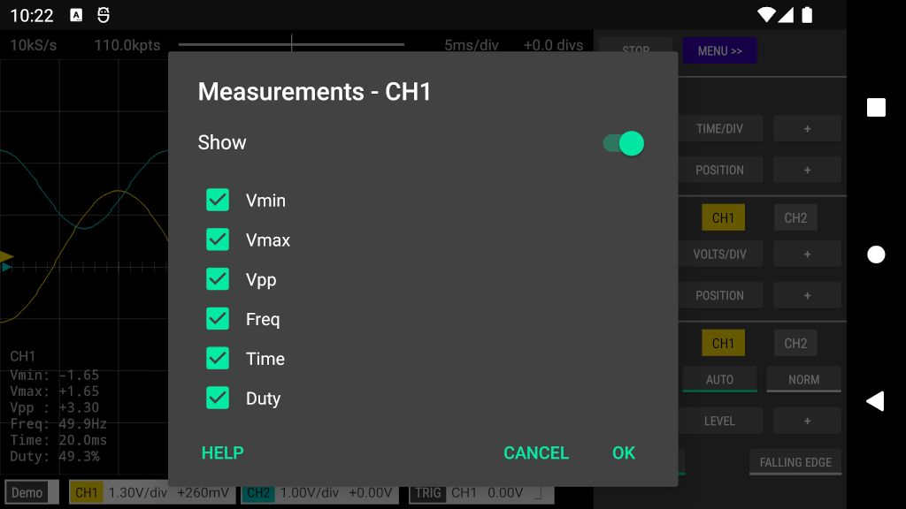
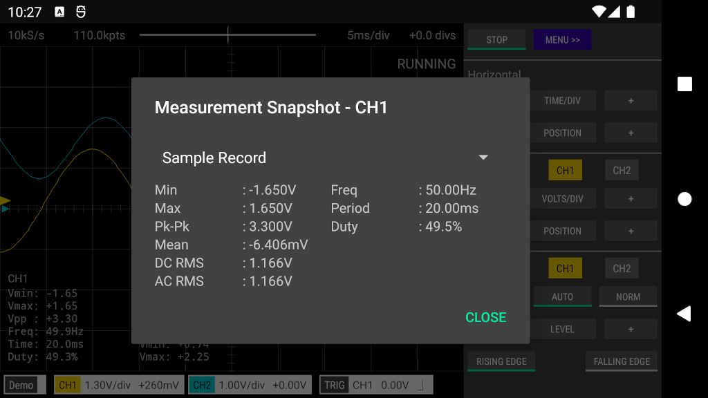

 

### 1. On-screen

These are measurements that are displayed directly on the Oscilloscope or Logic Analyzer screen.

 

To configure the on-screen measurements tap the channel badge at the bottom of the screen, then tap _Measurements_ and then tap _On-screen_.
Alternatively, tap an on-screen measurement to open the measurement configuration window (in Logic Analyzer mode, tap the far left of the screen).   

Individual measurements can be shown/hidden via the checkboxes next to each measurement. To hide all measurements for the
channel, tap the Show/Hide switch at the top of the configuration window.

 

### 2. Snapshot

The measurement snapshot shows all available measurements at a single point in time. Measurements can span the entire
sample record or just the samples displayed on the screen. Tap the drop-down menu at the top of the measurement snapshot window to
choose the required interval. 

To open the snapshot measurement window, tap the channel badge at the bottom of the screen, 
then tap _Measurements_ and then tap _Snapshot_.
Alternatively, tap-and-hold an on-screen measurement to open the measurement snapshot window (in Logic Analyzer mode, tap-and-hold
the far left of the screen).

 

### 3. Measurement types

#### Min or Vmin (Minimum)
Minimum is the lowest voltage value in the measurement interval.

#### Max or Vmax (Maximum)
Maximum is the highest voltage value in the measurement interval.

#### Pk-Pk or Vpp (Peak-Peak)
The peak-to-peak value is the difference between the Maximum and Minimum voltages in the measurement interval.

#### Mean or Average
Average is the sum of the voltages of the samples divided by the number of samples.

#### DC RMS
The root-mean-square of all samples in the measurement interval.

#### AC RMS
AC RMS is the root-mean-square value of the waveform with the DC (ie. average) component removed.
This is the same as the standard deviation of the samples.

#### Time or Period
Period is the time period of the complete waveform cycle. The time is measured
between the middle threshold points of two consecutive rising edges. The middle threshold is
the halfway point between Vmin and Vmax.

#### Freq (Frequency)
1/Period

#### Duty (Duty Cycle)
The duty cycle is the ratio of the positive samples to all samples in the measurement interval, expressed as a percentage.
A positive sample is one whose voltage level is higher than the halfway point between Vmin and Vmax.

 
[App Help](.)     
[All Documentation](../TOC)         
[Scoppy on GitHub](https://github.com/fhdm-dev/scoppy)
