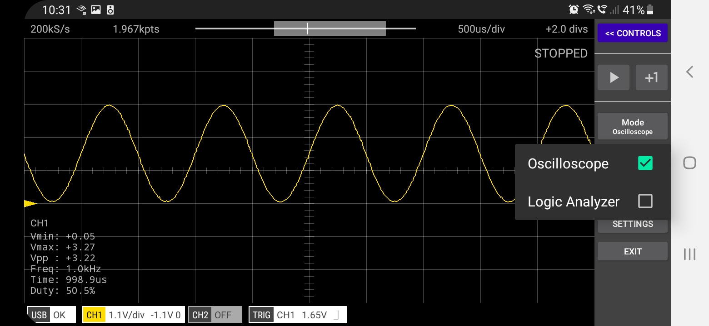

The app can be run in either Oscilloscope or Logic Analyzer modes (but not both at once). The mode is changed by tapping the Mode button on the
main menu panel.

      
In Oscilloscope mode, signals are captured on GPIOs 26 & 27.
In Logic Analyzer mode, signals are captured on GPIOs 6 to 13. 

 
[App Help](.)     
[All Documentation](../TOC)         
[Scoppy on GitHub](https://github.com/fhdm-dev/scoppy)
