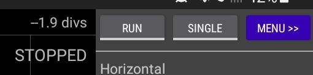
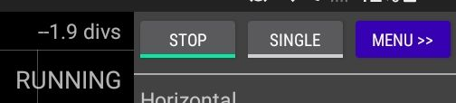
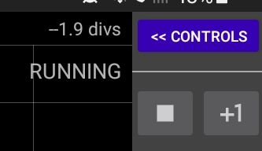

# RUN/STOP

Tapping this button will toggle between Run and Stop modes.

When RUN is tapped the app will first try and connect to the Pico and you might see
an Android prompt asking for permission to read from the USB device. When/if connected the app will continuously recieve and display sample
date from the Pico.

When STOP is tapped the app will stop receiving sample data from the Pico and display the most recently received data.

The RUN/STOP and SINGLE buttons are also on the main menu panel.

 

# SINGLE

When this button is tapped the app will capture a single record of sample data and then stop. The record length is 100k samples (except where the
sample rate is so low that capturing this many samples would take more than 10 seconds).    

Single capture mode is useful for when you wish to zoom in or out of the sample record and so require a large number of samples to be captured and/or
when you want to trigger on a single event such as turning on a switch.

When doing a single capture the currently selected trigger mode will be used (ie. Off, Auto or Normal). 

 
#### See Also

