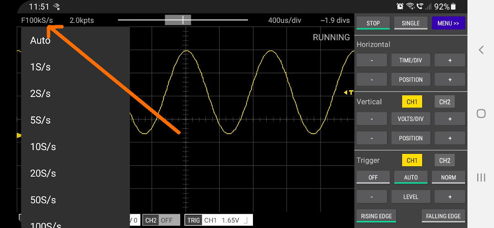

You may have noticed that Scoppy changes the sampling rate as you change the Time/Div setting. This can be annoying if you
are zooming in and out of a signal but want the sampling rate to stay the same (especially when doing consecutive
single shot captures).    

To avoid this problem you can set a fixed sampling rate. To do this just tap the sample rate at the top-left of the
screen and select a sample rate from the menu. You can also toggle between auto sample rate and fixed sample rate by tapping and
holding the sample rate at the top left of the screen.

When Scoppy is using a fixed sample rate, an F will be displayed
next to the sample rate. Note that the displayed sample rate is that of the currently displayed signal and this can
be different to the selected fixed sample rate if the run mode is STOPPED.

 
[App Help](.)     
[All Documentation](../TOC)         
[Scoppy on GitHub](https://github.com/fhdm-dev/scoppy)
