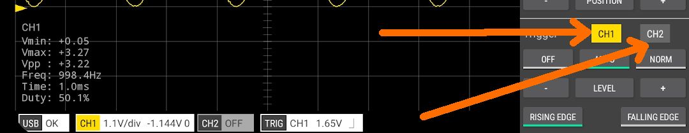
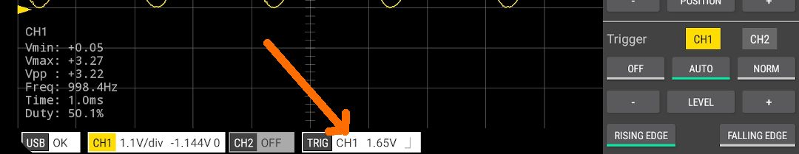
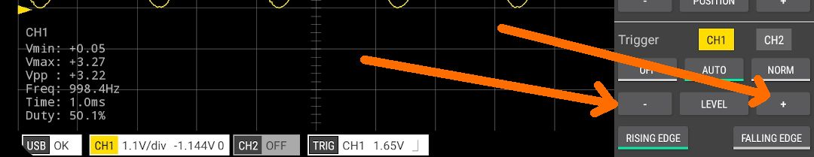
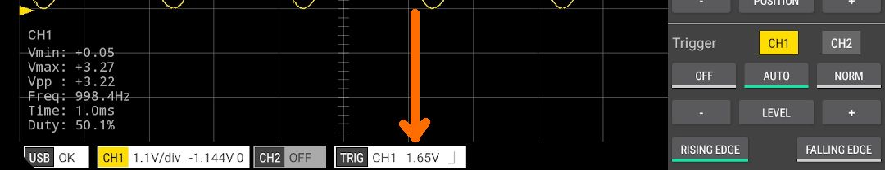
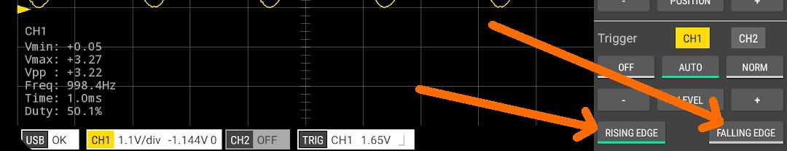
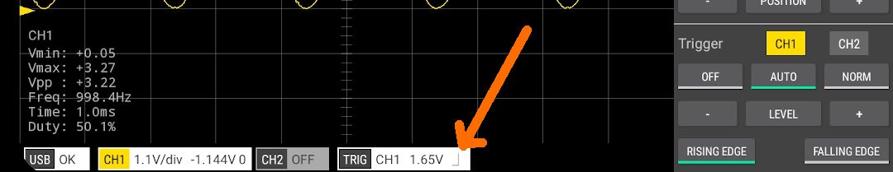

### Channel selection

The channel that will be triggered on can be selected by:
1. Tapping the CH1 or CH2 buttons in the trigger section of the control panel.

2. Tapping the TRIG badge at the bottom of the screen and selecting *Channel* from the popup menu.

Note. If the selected trigger channel is not enabled (switched on) then triggering will not occur.

The trigger channel is displayed in the TRIG badge at the bottom of the screen.

 

### Trigger level

The trigger voltage level can by adjusted by:
1. Tapping the plus(+) or minus(-) buttons in the Trigger section of the control panel.

2. Tapping the LEVEL button. This will allow you to enter an exact value.
3. Tapping and holding the LEVEL button. This will set the trigger level to the midpoint of the displayed waveform.
4. Tapping the TRIG badge at the bottom of the screen and selecting *Level* from the popup menu.

The trigger level is displayed in the TRIG badge at the bottom of the screen.

### Trigger types

Scoppy can trigger on either the rising or falling edge of a waveform. Select the trigger type by:
1. Tapping the *RISING EDGE* or *FALLING EDGE* buttons on the control panel.

2. Tapping the TRIG badge at the bottom of the screen and selecting *Type* from the popup menu.

The trigger type is displayed in the TRIG badge at the bottom of the screen.

 

### Trigger modes

#### OFF

In the OFF mode (called Roll Mode on some Oscilloscopes), triggering is disabled and Scoppy displays the
most recent samples of the sample record. This is
useful for high TIME/DIV settings (ie slow sweep speeds) where waiting for a full screen of samples to be
aquired could take a long time.  

#### AUTO

Scoppy will look for a trigger point and if found display the waveform. If not triggered withing a short period of time Scoppy
will go ahead and display the waveform anyway.

#### NORM

Scoppy will wait for a trigger before updating the displayed waveform. If RUN or SINGLE is selected after NORMAL trigger mode
has been selected, the screen will remain blank until the scope is triggered and the run mode will be shown as *RUNNING*.

 

### Pre-trigger samples

Scoppy normally tries to position the trigger sample in the center of the sample record. This can be sub-optimal if most of the samples
you're interested in are located either before or after the trigger sample. The *Pre-trigger samples* setting
allows you to specify the percentage of the samples that will appear before the trigger point in the sample record.

The setting can be adjusted by tapping the TRIG badge at the bottom of the screen and selecting *Pre-trigger samples* from
the popup menu.

When any value other than 50% is selected for the pre-trigger samples, the value is displayed in the TRIG badge.

 
[App Help](.)     
[All Documentation](../TOC)         
[Scoppy on GitHub](https://github.com/fhdm-dev/scoppy)
