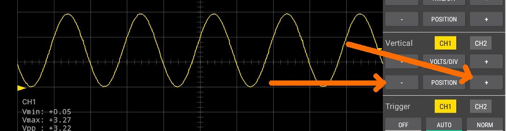
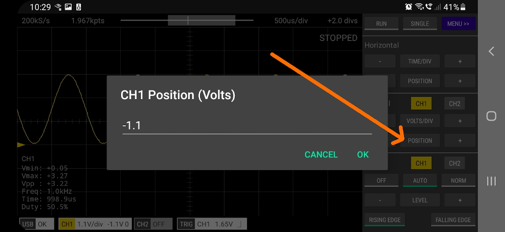

There are a number ways that the vertical position can be adjusted.

 

### 1. Touch Gestures

Swipe up or down on the screen. The trace for the selected channel will move vertically.
The selected channel can be changed by tapping the CH1 or CH2 buttons in the Vertical section
of the control panel.

A channel can also be selected by tapping its ground indicator (the right pointing arrow at the left
of the screen).

 

### 2. POSITION + and - Buttons

Single tap these buttons or tap-and-hold to change the vertical position of the selected channel.

 

### 3. Single Tap the POSITION Button

This allows you to enter an exact value for the vertical position of the selected channel.

 

### 4. Tap and Hold the POSITION Button

This will set the vertical POSITION of the selected channel to its default value (0V).

 

