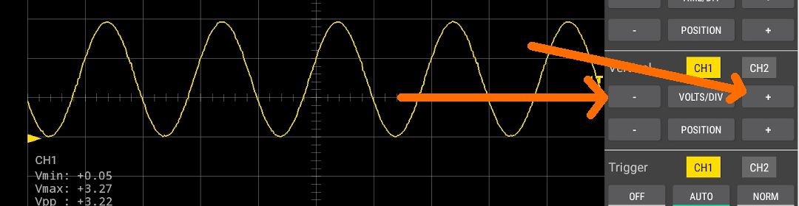
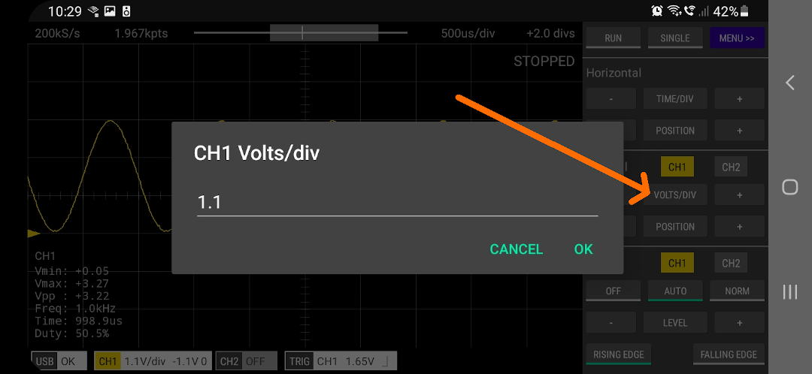

There are a number ways that the vertical scale (Volts/div) can be adjusted.

 

### 1. Touch Gestures

Pinch and zoom on the screen vertically. The trace for the selected channel will be scaled.
The selected channel can be changed by tapping the CH1 or CH2 buttons in the Vertical section
of the control panel.

A channel can also be selected by tapping its ground indicator (the right pointing arrow at the left
of the screen).

 

### 2. VOLTS/DIV + and - Buttons

Single tap these buttons or tap-and-hold to change the volts/div for the selected channel.

 

### 3. Single Tap the VOLTS/DIV Button

This allows you to enter an exact value for the selected channel.

 

### 4. Tap and Hold the VOLTS/DIV Button

This will set the VOLTS/DIV for the selected channel to its default value (the default value depends on the input voltage range setting for the channel).

 

