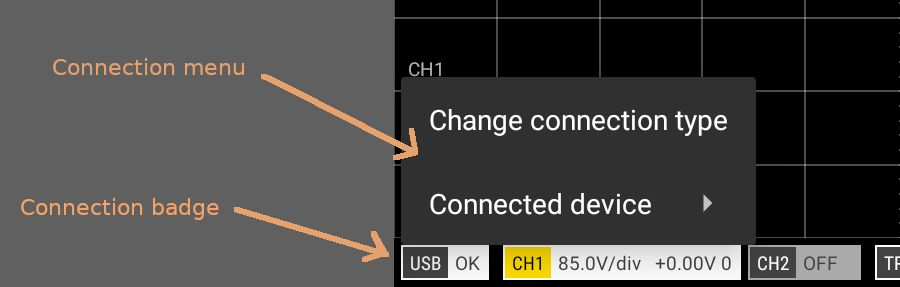



<!--
> This document assumes you have already installed the scoppy-pico-wireless [firmware]({{glossary_firmware}}) onto your Pico W (please note that the non wireless scoppy-pico firmware will not work on the Pico W). 
-->

> This document assumes you have already installed the appropriate [firmware](./Installation-&-Getting-Started.md) onto your Pico W

## Introduction

The Scoppy firmware on the Pico W can connect to your Android phone/tablet via USB or via Wi-Fi. When connecting via Wi-Fi,
 the Pico W can be configured as either an access point or as a Wi-Fi client (AKA station).

The first thing that you will probably want to do is to configure the Pico W as a client/station so that it can connect to your local network.
The procedure for doing this is described below.

## Initial setup

The initial setup can be performed either via USB or Wi-Fi. Both methods are described here. 

The image below shows the location of the 'Connection badge' which is referred to in this document.

### 1a. Initial setup via USB
* Look at the connection badge at the lower left of the app screen and check that the connection type is set to USB. If it isn't USB, tap the badge and then tap 'Change connection type' from the menu and then select USB.
* Attach the Pico W to your phone/tablet via a USB cable and OTG adapter. The OTG adapter plugs into the phone/tablet, not the Pico W!
* Android will now probably ask permission for the Scoppy app to access USB. Tap Yes/OK. 
* The connection badge at the lower left of the screen should display 'USB: OK'. Please note that if a connection over USB hasn't been established within 10 seconds the Pico W will start listening to connections over Wi-Fi. To try connecting via USB again the Pico W will need to be restarted.
* Tap the connection badge and select 'Connected device' and then 'Firmware settings' from the menu.
* Update the firmware settings. See step 2 below.
* You're now ready to connect to the Pico W using Wi-Fi. Change the connection type to Wi-Fi by tapping the Connection badge and selecting 'Change connection type'.
* Within a few seconds the Scoppy app should be connected to the Pico W over Wi-Fi.

### 1b. Initial setup via Wi-Fi
* Connect the Pico W to a 5V DC power supply.
* Wait until the status LED blinks with a sequence of 4 blinks followed by a 1 to 2 second pause. This indicates the Pico W is in access point mode
and is waiting for the Scoppy app to connect over Wi-Fi (if you are powering the Pico W from a computer or tablet it may take up to 10 seconds before the Pico W is ready to accept connections over Wi-Fi).
* Go to the Wi-Fi settings on your phone/tablet (eg. via the Android Settings app) and you should see a Network whose name begins with SCOPPY (eg. SCOPPY-A1234BC5678DE12A). Select this network. Please note that internet access will not be available while your phone/tablet is connected to the SCOPPY network.
* Go back to the Scoppy app.
* Tap the Connection badge at the lower left of the screen. This will display the connection menu.
* Tap the 'Change connection type' menu item and then select Wi-Fi.
* The Scoppy app will automatically connect to the Scoppy firmware on the Pico W (the connection badge should display 'Wi-Fi OK'). You may need to tap the RUN button to establish the connection.
* Tap the connection badge again and select 'Connected device' and then 'Firmware settings' from the menu.
* Update the firmware settings. See step 2 below.
* When the Pico W restarts your phone/tablet should automatically reconnect to your local network. If not, go back to the Wi-Fi settings on your phone/tablet (eg. via the Android Settings app) and select your local network.
* The app should soon connect to the Pico W. Once the connection is established the status led on the Pico W will stop blinking.
* If the Pico W fails to connect to the local network and you need to update the firmware settings again then you can do this via USB or you can set the Pico W back to access point mode by copying [flash_nuke.uf2](https://datasheets.raspberrypi.com/soft/flash_nuke.uf2) to the Pico W. If you nuke the flash, the scoppy firmware (uf2) file will need to be copied back to the Pico W.

### 2. Update Firmware settings on the Pico W
* Tap the Connection badge at the lower left of the screen and tap 'Connected device' and then 'Firmware settings' from the menu.
* Select your country from the _Wi-Fi Country_ list
* Change the Wi-Fi mode to Station/Client
* Enter the SSID and password of your network's access point
* If you know the type of authentication that is configured on your access point then select the appropriate option. Otherwise leave this as WPA2/WPA Mixed.
* Leave the Scoppy Access Code field blank.
* Tap OK
* Restart your Pico W
* Continue with the remainder of step 1a or 1b above

## More connection options
The Scoppy app will connect to the first Pico W (with the scoppy-pico-wireless firmware installed) that it finds on the network.
It you have more than one Pico W on the network you can configure the app to connect to a specific device.

Scoppy also provides (optional) access control to ensure only authorized Android devices can connect to a particular Pico W. 
This could be useful in a classroom situation where there are many devices on the network and you want to prevent students from connecting the app to the wrong Pico W.

See the [Wi-Fi How-To](./WiFi-How-To) and [Wi-Fi Connection Settings](../app-help/WiFi-Connection-Settings) documentation for more information.

## See also

 

