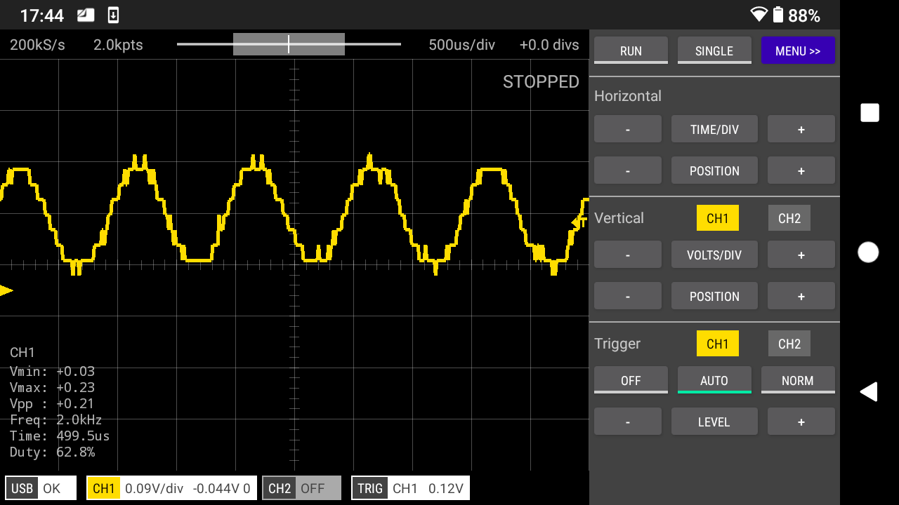
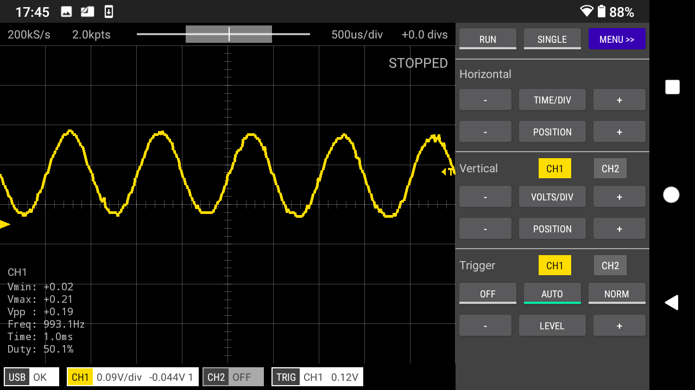

> If you have suggestions for improvements or would like to share your own designs for a Scoppy analog front end then please head to the [Scoppy forum](https://github.com/fhdm-dev/scoppy/discussions).

This design demonstrates how to add multiple voltage ranges (sensitivities) to our oscilloscope. It is similar to previous designs except for the addition of the the dual pole, four throw switch.

One of the poles is used to select the feedback resistor (Rf1 to Rf3) and thus the amplification of the op-amp. The other connects to the 'Channel 1' voltage range GPIOs on the pico. See the [here](./Analog-Front-End) for details of the voltage range GPIOs.

The voltage ranges are 0V-6.6V (no feedback resistor), 0V-3.3V (100K feedback resistor), 0V-1.8V (270K feedback resistor) and 0V-0.8V (680K feedback resistor). These voltage ranges also need to be configured in the app (to do this tap the Channel badge at the bottom of the screen and tap settings).

       

 

Lowest sensitivity setting   

 

Higher sensitivity setting   

     
     
     
    
> The author makes no warranty, representation or guarantees regarding the suitability of this design for any particular purpose. Nor does the author assume any liability arising out its use and specifically disclaims any and all liability, including without limitation special, consequential or incidental damages.

 
### See Also


