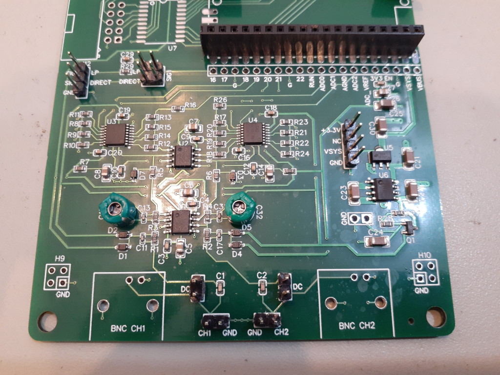

The [_FScope-250k5_](https://store.fhdm.xyz/fscope-250k5) is a 2 channel oscilloscope analog front end for use with the Raspberry Pi Pico or Pico W and the Scoppy Android app.

### Features and Specifications
- Input impedance: 1M Ohm / 22pF
- Four input voltage ranges (sensitivity levels): +-6V, +-2V, +-1V, +-0.5V
- Compatible with 10X probes
- Overvoltage protection (tested up to +-20V)
- Access to all pins of the Raspberry Pi Pico
- Signals can be input via 0.1" header pins or BNC connectors
- Built-in low pass filter enables generation of analog signals via PWM 
- AC and DC coupling of the input signals
 

### Assembly

You will need to supply:
- One Raspberry Pi Pico or Pico W
- 7 pairs of 0.1" male headers (or 6 pairs and 2 compatible BNC connectors)
- If the Pico is not to be soldered directly to the board (ie. it will be removable) then 
2 sets of 20 0.1" pin headers are also required.
- 3 jumpers (shunts)

#### 1. Trimmer Capacitors

- Solder the included green trimmer capacitors to C15 and C32. Polarity is not important.

#### 2. Input Connectors

- Solder pairs of 0.1" male headers to each of CH1/GND and CH2/GND (these can be found at the bottom of the board).

#### 3. AC/DC Coupling pins

- Find the pairs of holes labeled DC. Solder male headers to these and install a jumper (shunt) to connect the two header pins. When the pins are connected like this the channel is in DC coupling mode. Remove the jumper for AC coupling.

#### 4. Signal Generator output and low-pass filter

- Solder 2 headers to the holes labeled 'SIG' (or 'SIG1') at H12.
- Solder headers to the holes at H4.

#### 5. Raspberry PI Pico

The Pico can be soldered directly to the board or via headers so that it can be easily removed.

 

### Firmware Installation

Download and install the Scoppy FScope firmware. Instructions are on the [Installation & Getting Started](../wiki/Installation-&-Getting-Started) page.

The firmware file for the Pico is named scoppy-pico-fscope-250k5-vNN.uf2 and the file for the Pico W is named scoppy-pico-wireless-fscope-250k5-vNN.uf2 (where NN is the version number).

### Trimmer capacitor adjustment
Feed a 1kHz square wave into the CH1 input (using jumper wires or 1X probes - do NOT use 10X probes) and then adjust the trimmer capacitor (C15) until the displayed signal in the Scoppy app looks square. You'll need a small screwdriver to do the adjustment. Screwdrivers like those supplied with oscilloscope probes should work.

You can use the Scoppy signal generator to generate the 1kHz square wave as follows:
#### If you have Rev. 2 of the FScope board (see the back of the board for the Revision number):
1. Connect the two bottom pins on H4 with a jumper. If there is a jumper on the top row then remove that.
2. Connect the lower SIG1 pin (DIRECT) on H2 to CH1 with a jumper wire. 
3. You should see a square wave in the Scoppy app. Ensure the volts/div for CH1 is greater than 600mV (input voltage range 0) otherwise the signal might get clipped.

#### If you have Rev. 3 or later of the FScope board:
1. If there is a jumper on H4 then remove that.
2. Connect the lower SIG pin (DIRECT) on H2 to CH1 with a jumper wire. 
3. You should see a square wave in the Scoppy app. Ensure the volts/div for CH1 is greater than 600mV (input voltage range 0) otherwise the signal might get clipped.
   
> See below for more information about the signal generator pads on the board.
   
Repeat the procedure for CH2 (the trimmer capacitor for CH2 is labeled C32).

### Board Features

#### Input voltage ranges

The FScope-250k5 board will automatically change the input voltage range (sensitivity) as you adjust the volts/div setting in the app. The best vertical resolution is
obtained by adjusting volts/div so that the trace fills most of the screen vertically (assuming the vertical position is 0). Further increases in volts/div
may result in the signal being clipped.
    
When the voltage range changes you'll probably see the trace momentarily 'jump'. This is expected.   
   
The currently selected voltage range can be seen on the channel badge at the bottom of the app screen (a number between 0 and 3). To manually select a voltage range, tap the channel badge and then tap 'Select input voltage range'.   
   
The actual values of the voltage ranges are uploaded to the app from the Pico when the board is connected to the Android device.
If you make changes to the voltage ranges in the app they be lost when the board is next connected. 

#### Signal generator (the following applies to Rev. 2 of the FScope board - see the back of the board for the revision number)

The output from the Scoppy signal generator is accessed via the two SIG1 pins at H12 on the board.
   
The upper pin (LP) is used when you want the signal to be fed through the low-pass RC filter (eg. when 'Sine Wave (PWM)' is selected as the signal type in the Scoppy app). When using the SIG1 LP pin, the top two pins of H4 need to be connected with a jumper.

The lower SIG1 pin (DIRECT) is used for direct access to the signal generator output.  When using the SIG1 DIRECT pin, the lower two pins of H4 need to be connected with a jumper. Note: if the upper 2 pins of H4 are connected this will affect the output of the signal generator and so the jumper on these pins should be removed when using the SIG1 DIRECT pin. 

#### Signal generator (the following applies to Rev. 3 and higher of the FScope board - see the back of the board for the revision number)
 
The output from the Scoppy signal generator is accessed via the two SIG pins at H12 on the board.
   
The upper pin (LP) is used when you want the signal to be fed through the low-pass RC filter (eg. when 'Sine Wave (PWM)' is selected as the signal type in the Scoppy app). When using the SIG LP pin, the two pins of H4 need to be connected with a jumper.

The lower SIG pin (DIRECT) is used for direct access to the signal generator output. Note: If the 2 pins of H4 are connected this will affect the output of the signal generator and so the jumper on these pins should be removed when using the SIG DIRECT pin.

#### AC/DC Coupling

The pins marked DC are used to select AC or DC coupling. Connect the pins with a jumper for DC coupling. Leave the pins unconnected for AC coupling.

#### BNC Connectors

The board can be used with the inexpensive BNC connectors available on sites such as eBay, [Amazon](https://amzn.to/3HhM9zo) or Aliexpress. The footprint can be found in the datasheet [here](https://lcsc.com/product-detail/RF-Connectors-Coaxial-Connectors_dosinconn-DOSIN-801-0038_C709673.html).

#### 10X Probes

The board is compatible with 10X probes. The probe attenuation can be set in the app by tapping the channel badge at the bottom of the screen
and then tapping 'Settings' and 'Probe'.
   
The frequency compensation of 10X probes will need to be adjusted to match in the input capacitance of the oscilloscope.

#### Miscellaneous

H9, H10 - these are tiny prototyping areas.

##### Rev 2. only

H7, C28 and H6 - for a second signal generator (not implemented) - these will be removed in the next revision of the board.

CN1 and U7 - For attaching an IDC connector and 5V->3.3V level shifter (SN74CB3T3245DWR). Allows the Scoppy logic analyzer to be used with 5V circuits. This will be removed in future revisions of the the board.

H4 - The bottom row is not actually necessary and will be removed in the next revision of the board.

The holes at the corners of the board are 4mm (160 mil).

##### Rev 3. and later

The holes at the corners of the board are 3.3mm (130 mil).

 

