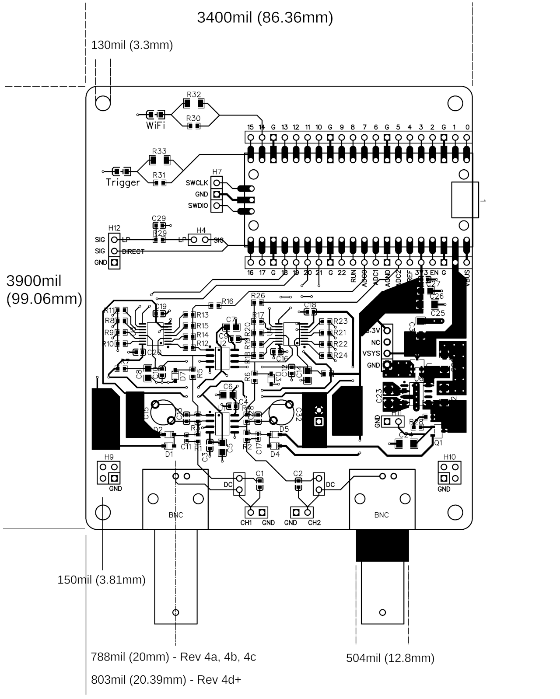

> All dimensions described below assume you are looking at the board from above with the BNC connectors closest to you.

# Board revision 4c and lower

## Board
### Size
3400mil (86.36mm) wide x 3900mil (99.06mm) high
Tolerance: 16mil (0.4mm)
### Thickness
63mil +/-8mil  (1.6mm +/-0.2mm)

## Mounting holes
### Position
The centre is 150mil (3.81mm) from the two nearest edges
### Size
130mil (3.3mm) diameter
Tolerance +/-8mil   (+/-0.2mm)

## BNC Connectors
### Position
The centre of the connector (along the y axis) is 787.7mil (20mm) from the nearest edge (measured along the x axis of the board)
### Plastic barrel width
504mil (12.8mm)

# Board revision 4d and higher
Same as 4c except

BNC Connectors
### Position
The centre of the connector (along the y axis) is 802.72mil (20.39mm) from the nearest edge (measured along the x axis of the board)

 
 
 
<figure>
    
</figure>

 


 
https://easyeda.com/editor#id=7a9592295c7c47f5bbd8dca3723c8790
