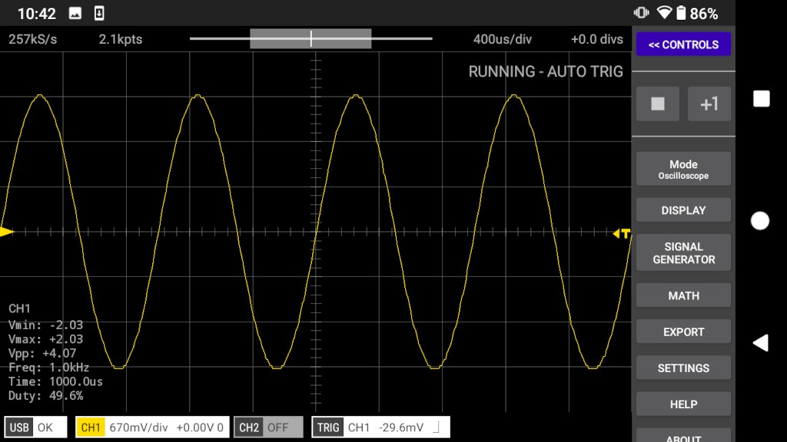
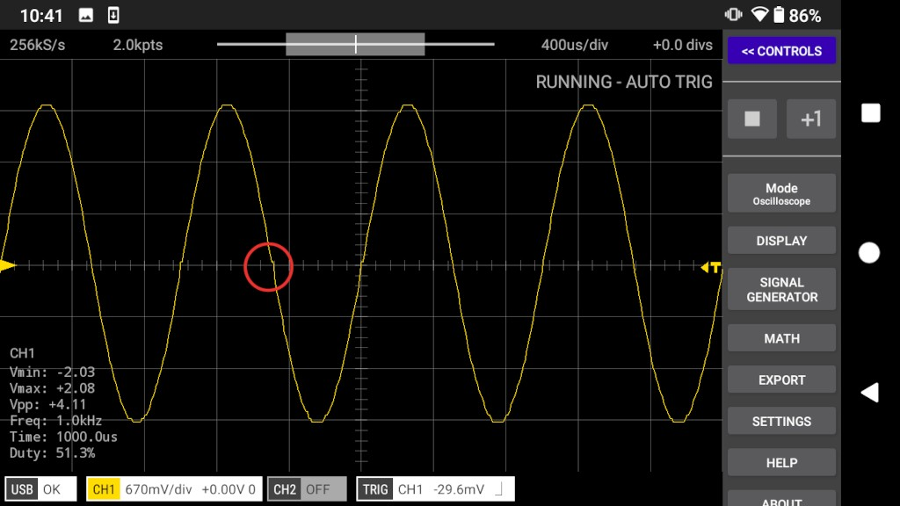
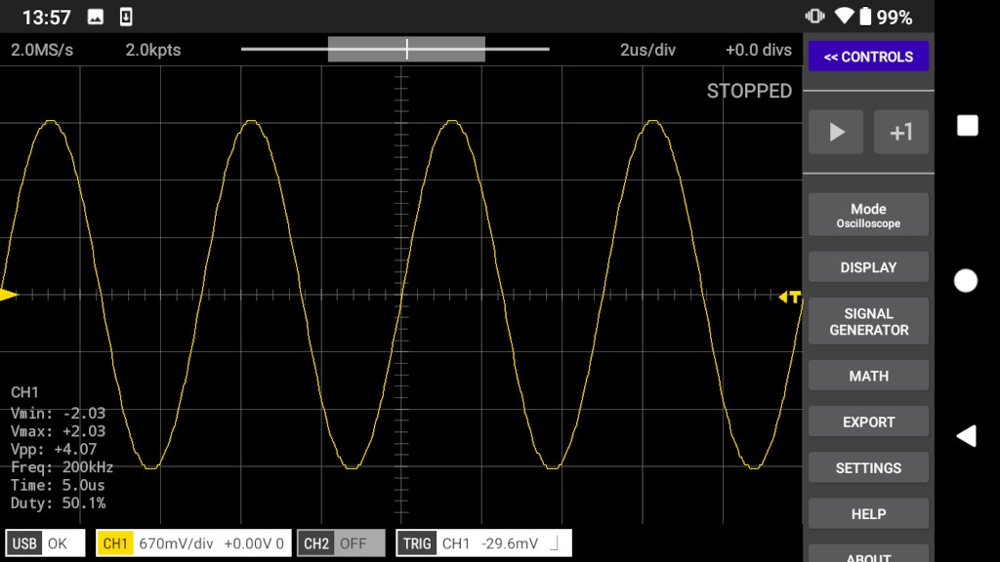
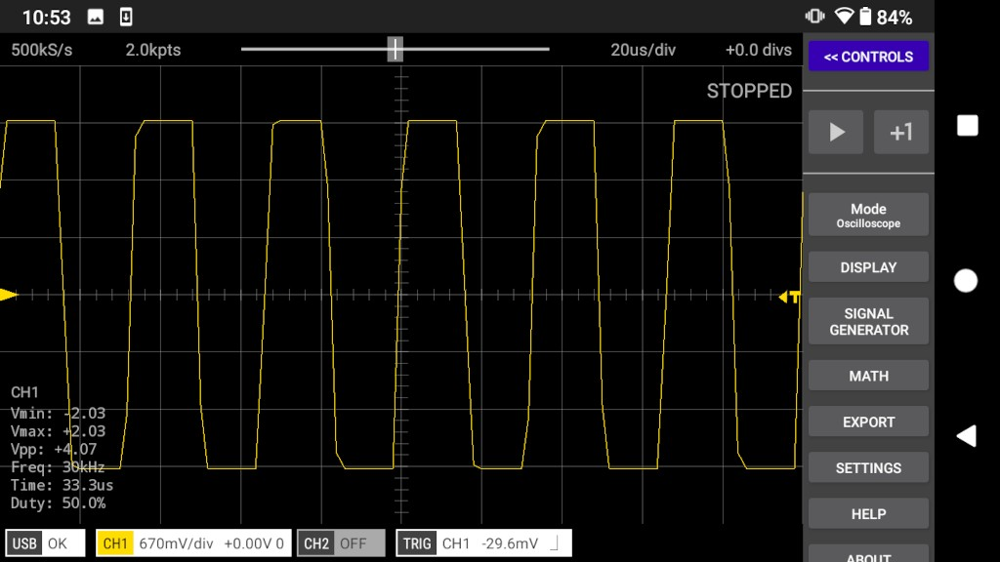
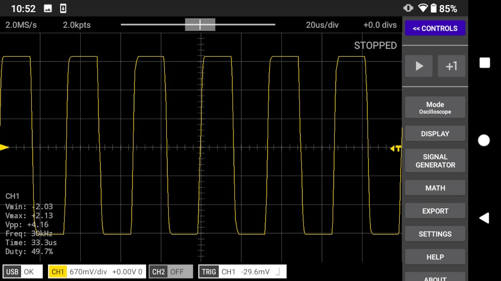
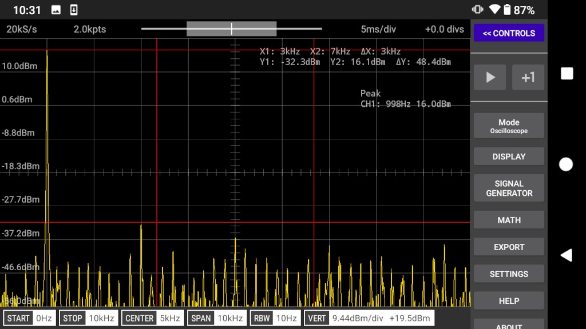
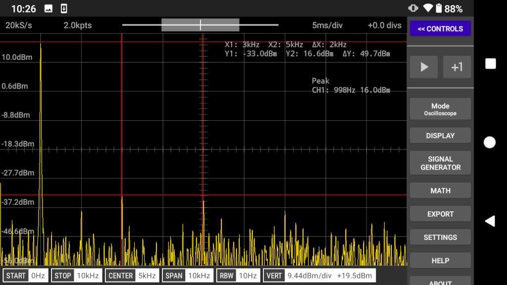
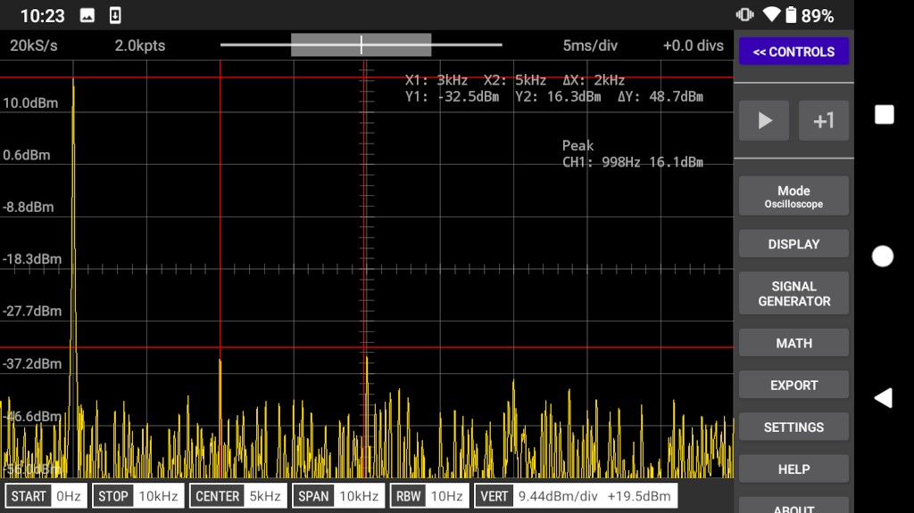

## About

The RP2040 datasheet states that the clock source for the built-in ADC must be 48MHz and that each ADC conversion takes 96 clock cycles.
This gives a maximum sample rate of 500kS/s (ie. 48000000 / 96 = 500000). This in turn limits the maximum bandwidth achievable by any oscilloscope
that relies on the built-in ADC of the RP2040 MCU.

However, if we ignore the datasheet and clock the ADC at a higher rate then we can achieve higher sample rates.

The Scoppy Android app allows us to choose from 3 different values for the maximum sample rate. They are:
* 500kS/s - The default - the ADC is clocked at 48MHz
* 1.3MS/s - The ADC is clocked at 125MHz
* 2.0MS/s - The ADC is clocked at 192MHz

The following tests were performed to allow us to determine if overclocking the ADC adversely affects performance of the oscilloscope.

All tests were performed using an [FSCOPE-500K](https://store.fhdm.xyz/fscope-500k) board as the analog front-end to the RP2040 ADC. For the 200kHz sine wave tests, the MCP6002 op-amp on the board was
replaced with an amplifier with higher GBW and slew rate.

## Tests

The 3 different _Max. Sample Rate_ settings were tested with a 1kHz sine wave, 200kHz sine wave, 30kHz square wave and DC. The FFT of the
1kHz sine wave was also recorded.

### 1kHz Sine Wave

The results were very similar except at the 2.0MS/s setting where there is small but visible distortion at about 0V. 

#### 500kS/s

 

#### 1.3MS/s

 

#### 2.0MS/s

The red circle shows an area of distortion that is not visible at the lower _max. sample rate_ settings.

### 200kHz Sine Wave

Using the default 500kS/s setting the waveform is extremely wonky! The higher sample rates result in a
much less distorted waveform.

#### 500kS/s

 

#### 1.3MS/s

 

#### 2.0MS/s

 

### 30kHz Square Wave

#### 500kS/s

 

#### 2.0MS/s

 

### 1kHz Sine Wave FFT

Changing the max. sample rate setting has very little affect on distortion. Measured using the amplitude of the
3rd and 5th harmonics. 

#### 500kS/s

 
#### 1.3MS/s

 

#### 2.0MS/s

 

### DC

The signal generator was set to 2.0V. The voltage measured at the scope input with a DMM was 2.07V. Increasing the max. sample rate
setting does affect the measured voltage of DC signals (approx. 2%).

#### 500kS/s

Measured voltage = 2.08V

 
#### 1.3MS/s

Measured voltage = 2.13V

 
#### 2.0MS/s

Measured voltage = 2.13V

 
## See Also
[RP2040 Max. Sample Rate Setting](../app-help/rp2040-max-sample-rate-setting)



